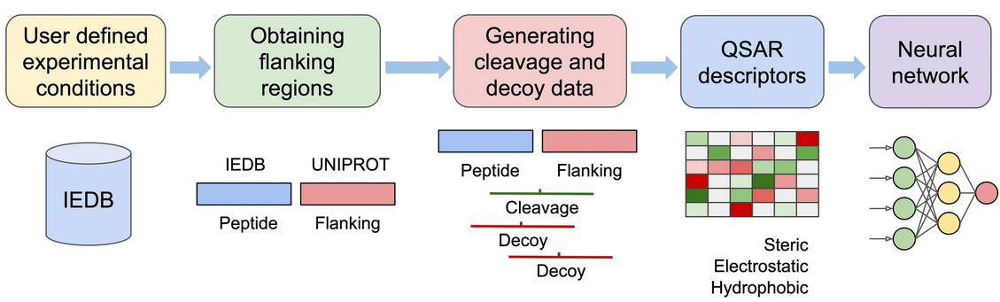

# NetCleave

NetCleave is a retrainable Neural Network method for predicting C-terminal peptide processing of MHC (class I and II) pathways. In brief, NetCleave maps reported Immune Epitope Database (IEDB) peptides to protein sequences in UniProt/UniParc. Once the C-terminal cleavage site (4+3 residues) is identified, the amino acid sequences are coded using QSAR descriptors, including steric, electrostatic, and hydrophobic properties. Finally, a Neural Network architecture is used to generate the predictive model.

<p align="center">

</p>

## Dependencies

NetCleave has the following dependencies (Python,R):

- [argparse](https://docs.python.org/3/library/argparse.html)
- [pandas](https://pandas.pydata.org/)
- [numpy](https://numpy.org/)
- [matplotlib](https://matplotlib.org/)
- [pathlib](https://docs.python.org/3/library/pathlib.html)
- [sklearn](https://scikit-learn.org/stable/)
- [keras](https://keras.io/)
- [tensorflow](https://www.tensorflow.org/)
- [biopython](https://biopython.org/)
- [dplyr](https://dplyr.tidyverse.org/)
- [argparser](https://bitbucket.org/djhshih/argparser)

## How to use NetCleave

NetCleave has two main functionalities, which are **C-terminal processing prediction** and **Model retraining**.

### C-terminal processing prediction

The scoring option can be used to predict the C-terminal cleavage of peptides. It allows three different types of input:

1. FASTA file of a single protein, from which epitopes (8 to 11 residue-long) will be generated and scored.

```
python3 NetCleave.py --predict (fasta) --pred_input 1
```

2. CSV file with peptide sequences to predict (column name: *epitope*) and the UniProt identifier of the protein where they come (column name: *uniprot_id*). NetCleave will retrieve the sequence of the whole protein, and create the 4+3 sequences that conform the cleavage site and are necessary for the scoring method.

```
python3 NetCleave.py --predict (csv)  --pred_input 2
```

3. CSV file with peptide sequences to predict (column name: *epitope*), the identifier (column name: *protein_id*) and sequence of the protein where they come (column name: *protein_seq*). Same as type 2, those complete protein sequences will be used to create the 4+3 sequences.

```
python3 NetCleave.py --predict (csv)  --pred_input 3
```

### Model retraining

One of the main advantages of NetCleave is that can be retrained, so it is updated and can adapt to your specific goal. To do so, you can choose between three retraining types:

1. Use an updated version of the IEDB

```
# Generate training data
python3 NetCleave.py --generate --train_input 1 --peptide_data (IEDB data path) --data_path (output training data path)

# Train NetCleave with data generated previously
python3 NetCleave.py --train --data_path (training data path) --model_path (output model path)

# Use model for C-terminal predictions
python3 NetCleave.py --predict (fasta) --pred_input 1 --model_path (model path)
```

2. Use an updated version of the IEDB combined with another dataset

```
# Generate training data
python3 NetCleave.py --generate --train_input 2 --peptide_data (IEDB data path) --peptide_data_additional (other data path)  --data_path (output training data path)

# Train NetCleave with data generated previously
python3 NetCleave.py --train --data_path (training data path) --model_path (output model path)

# Use model for C-terminal predictions
python3 NetCleave.py --predict (fasta) --pred_input 1 --model_path (model path)
```

3. Use another dataset (not IEDB)

```
# Generate training data
python3 NetCleave.py --generate --train_input 3 --peptide_data (other data path) --data_path (output training data path)

# Train NetCleave with data generated previously
python3 NetCleave.py --train --data_path (training data path) --model_path (output model path)

# Use model for C-terminal predictions
python3 NetCleave.py --predict (fasta) --pred_input 1 --model_path (model path)
```

## Other considerations

The IEDB provided version was retrieved on 29th November 2022.

If you use NetCleave, please cite us:

> <p align="justify"> Amengual-Rigo, P., Guallar, V. NetCleave: an open-source algorithm for predicting C-terminal antigen processing for MHC-I and MHC-II. Sci Rep 11, 13126 (2021). https://doi.org/10.1038/s41598-021-92632-y
</p>
